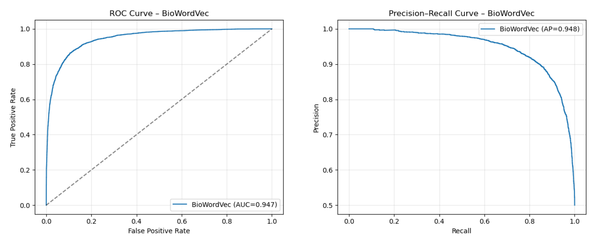
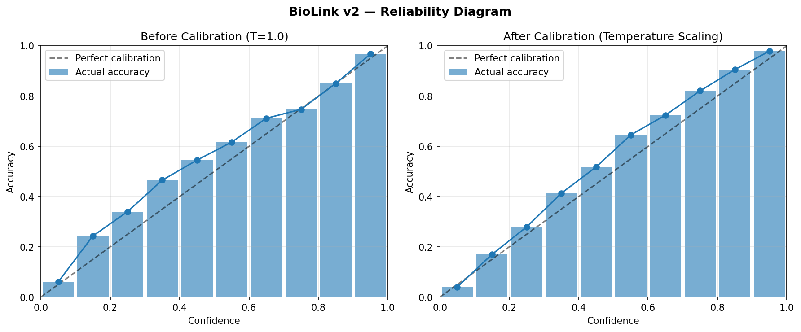

::: title-block

# BioLink: AI-Powered Drug Repurposing Discovery

[Dustin Haggett, Kera Prosper, Mia Braun]{.authors}

[AAI 595 — Applied Machine Learning]{.affiliation}
[Dr. Tao Han, Stevens Institute of Technology]{.affiliation}

:::

::: abstract-block

[*Abstract*]{.label}—Drug development is among the most expensive and time-consuming endeavors in modern science, with novel pharmaceutical compounds requiring ten to fifteen years and over \$2.6 billion to reach approval and failing more than ninety percent of the time. Drug repurposing — identifying new therapeutic applications for existing approved drugs — offers a substantially faster and cheaper alternative, but identifying promising candidates currently requires deep domain expertise and extensive literature review. We present BioLink, an AI-powered drug repurposing discovery tool that pairs a multi-layer perceptron classifier trained on BioWordVec embeddings of CTD drug-disease pairs (AUC = 0.947) with a multi-API enrichment pipeline that grounds each prediction in published evidence, FDA approval status, and current clinical trials. The system accepts natural-language input via a large-language-model intent mapper, scores up to 7,163 drugs or 2,525 diseases in milliseconds via batched inference, calibrates probabilities through temperature scaling, and surfaces evidence-grounded verdicts derived from a structured Perplexity Sonar literature retrieval. Deployed on Hugging Face Spaces, BioLink demonstrates that contemporary AI tooling — used both during construction and as runtime components — enables small teams to build production-quality clinical-adjacent applications within an academic-project time budget.

[*Index Terms*]{.label}—Drug repurposing, machine learning, multi-layer perceptron, BioWordVec, knowledge graphs, evidence-based medicine, large language models, probability calibration.

:::

## I. Problem Statement

### A. The High Cost of New Drug Development

Bringing a novel pharmaceutical compound from initial discovery to FDA approval is among the most expensive and time-consuming endeavors in modern science. Recent studies place the average development timeline at ten to fifteen years and the average capitalized cost at well over \$2.6 billion [1]. The vast majority of compounds entering this pipeline never reach patients: industry data consistently show failure rates exceeding ninety percent, with most candidates eliminated during late-stage clinical trials after costs have already mounted into the hundreds of millions of dollars. The combined effect of long timelines, high costs, and high attrition has produced a treatment landscape in which entire categories of disease — particularly those that are rare, neglected, or affect economically marginalized populations — receive virtually no novel pharmaceutical investment.

At the same time, the existing pharmacopoeia represents an enormous and underutilized resource. Thousands of drugs have already cleared the regulatory hurdles required to demonstrate safety in humans. Their pharmacokinetics are characterized, their dosing has been refined, and their long-term side effects are well documented. Many of these compounds may have therapeutic potential for conditions other than the ones for which they were originally approved, but identifying which drugs to investigate for which conditions remains a fundamentally difficult problem.

### B. Drug Repurposing and Its Limits

Drug repurposing — the practice of identifying new therapeutic uses for existing drugs — offers a substantially faster and cheaper alternative to de novo discovery [2], since repurposed candidates already carry established safety data and can often skip years of preclinical testing. The history of medicine offers striking examples: thalidomide, infamous as a 1950s sedative, was rehabilitated decades later as a treatment for multiple myeloma; sildenafil emerged from cardiovascular research before becoming Viagra; and metformin, a longstanding diabetes treatment, has more recently shown promise in oncology and longevity research.

Despite these successes, systematic repurposing remains difficult in practice. Identifying candidates for a given condition requires deep domain expertise, extensive literature review, and substantial manual effort. No accessible, well-validated tool currently allows a clinician, researcher, or informed patient to enter a disease and receive a ranked list of repurposing candidates grounded in published evidence. The closest alternatives are either specialized commercial platforms aimed at pharmaceutical companies — generally inaccessible to individuals — or general-purpose search engines that surface relevant literature without ranking, calibration, or synthesis.

### C. Why Machine Learning Is Well-Suited

The relationships between drugs and diseases form an enormous knowledge graph. The Comparative Toxicogenomics Database alone catalogs over seven thousand drugs, twenty-five hundred diseases, and hundreds of thousands of curated chemical-disease interactions drawn from the published biomedical literature [3]. Patterns in this graph — which compound classes tend to act on which biological pathways, which disease clusters share underlying mechanisms, which drugs have unexpected affinities for proteins outside their primary targets — are not feasibly identifiable through manual review. A machine learning model trained on this data, however, can learn these latent patterns and surface candidate associations that a human expert might never investigate.

BioLink demonstrates this concretely. A multi-layer perceptron trained on BioWordVec embeddings of drug-disease pairs achieves an AUC of 0.947 on held-out CTD data, meaning the model can reliably distinguish documented drug-disease associations from random pairings. We wrap that model in a consumer-facing application that makes its predictions accessible, interpretable, and grounded in real-world evidence — work that required substantial engineering around calibration, entity resolution, evidence integration, and user interface design.

### D. Societal Impact

Accessible drug repurposing tools have outsized social value. Roughly ninety-five percent of rare diseases have no FDA-approved treatment; for most, the patient population is too small to justify novel drug development under existing pharmaceutical economics, making repurposing the only economically viable path to therapy. Repurposed generics also dramatically expand pharmaceutical access in low-resource settings, and the COVID-19 pandemic showed how quickly repurposing screens can identify life-saving therapies — dexamethasone, a decades-old generic, was repositioned as a treatment for severe respiratory cases within months. Beyond researchers, BioLink is designed to be useful to patients and clinicians directly: patients can explore evidence-backed hypotheses for discussion with healthcare professionals, and clinicians considering off-label use can quickly survey existing evidence, ongoing trials, and known interactions. We do not believe BioLink replaces expert judgment; we built it as a hypothesis-generation tool, with appropriate disclaimers about its limitations.

## II. Project Description

### A. Solution Approach

BioLink is a full-stack web application built around a trained MLP classifier and a multi-stage pipeline that turns natural-language queries into ranked, evidence-grounded predictions. Users enter a disease name in plain English and receive a ranked list of drug candidates with calibrated confidence scores, each annotated with literature-derived evidence, FDA approval status, current clinical trials, and a plain-language explanation of why the candidate scored as it did. A reverse mode lets users enter a drug name and discover other conditions it might treat — a query pattern of particular interest to patients already taking a medication for one condition who want to know what else it might help.

The pipeline is designed around a core principle: model confidence alone is not enough. A high-scoring candidate from a knowledge graph model may reflect statistical patterns that fail to align with clinical reality, and a low-scoring candidate may simply lack training data despite being therapeutically promising. By layering evidence retrieval, mechanism-of-action analysis, and trial-status lookups on top of the raw model output, BioLink turns each prediction into something the user can actually evaluate, rather than a black-box ranking that demands trust.

The end-to-end flow has six stages. A user types a query in natural language; the system normalizes that query into a CTD entity using a Claude-powered intent mapper with fuzzy matching as a fallback; the MLP scores all candidate drugs (or diseases, in reverse mode) and outputs calibrated probabilities; an asynchronous enrichment layer queries PubMed, OpenFDA, and ClinicalTrials.gov in parallel; a Perplexity-powered evidence search retrieves relevant published literature for the top candidates; and finally, results are rendered in a Streamlit interface with confidence badges, evidence verdicts, exportable reports, and follow-up question support. In practice, the full pipeline takes roughly two to three seconds end-to-end for a typical query — about the upper limit before the application started feeling sluggish in testing.

### B. AI Model Architecture and Training

The core model is a multi-layer perceptron classifier. Each input is an 800-dimensional feature vector formed by concatenating the BioWordVec embeddings of a drug and a disease (200 dimensions each) with the absolute element-wise difference and element-wise product of those embeddings (another 200 dimensions each). This feature construction, drawn from prior work on knowledge graph completion, gives the model both the raw entity representations and a measure of their similarity in embedding space. The hidden layer contains 256 neurons with batch normalization, ReLU activation, and 30% dropout for regularization. The output is a single logit, which becomes a probability after sigmoid activation. We considered larger and deeper architectures during early experimentation, but the additional capacity offered no meaningful improvement on the held-out test set — a finding consistent with the relatively limited dimensionality and noise structure of the task.

Training data was drawn from CTD's curated chemical-disease associations, filtered to therapeutic-direct-evidence rows (`DirectEvidence == "therapeutic"`), yielding 39,265 positive drug-disease pairs. We generated an equal number of negative pairs by random sampling drug-disease combinations that did not appear in CTD, producing a balanced dataset of 78,530 examples. This was partitioned into 70/15/15 train/validation/test splits with stratification on the label and a fixed random seed. Hyperparameter selection used a small grid search over hidden-layer width, dropout rate, and learning rate. Headline performance and runtime characteristics are summarized in Table II, and Fig. 1 shows the corresponding ROC and precision-recall curves on the held-out test set. For comparison, we also evaluated a transformer-embedding baseline (sentence-transformers `all-MiniLM-L6-v2`) under the same pipeline; it reached AUC 0.912, confirming that the domain-specific BioWordVec embeddings give a meaningful lift over general-purpose sentence embeddings on this task. Qualitative review by team members familiar with the biomedical literature proved the most informative evaluation beyond these numbers: AUC summarizes discriminative ability but does not by itself reveal whether the model's top predictions are plausible to a domain expert.

| Metric | BioWordVec | Transformer |
|---|---|---|
| Test accuracy | 0.872 | 0.835 |
| Test AUC | 0.947 | 0.912 |
| Average precision | 0.948 | 0.911 |
| Precision@10 | 1.000 | 1.000 |
| Precision@100 | 1.000 | 1.000 |
| Expected Calibration Error (pre-scaling) | 0.087 | — |
| Expected Calibration Error (post-scaling) | 0.024 | — |

[Table II: Model performance on the held-out test set. The transformer baseline uses sentence-transformers `all-MiniLM-L6-v2` embeddings in the same MLP pipeline.]{.figure-caption}

| Runtime metric | Value |
|---|---|
| MLP inference latency (CPU, batched) | ~100 ms |
| End-to-end query latency | 2–3 s |
| Drug candidates scored per query | 7,163 |
| Disease candidates scored per query | 2,525 |
| Per-query API cost (typical) | $0.02–$0.03 |

[Table III: Runtime characteristics of the deployed system.]{.figure-caption}

::: figure-wide

:::

[Fig. 1. ROC curve (left, AUC = 0.947) and precision-recall curve (right, AP = 0.948) for the BioWordVec MLP on the held-out CTD test set.]{.figure-caption}

We considered more complex architectures such as graph neural networks and transformer-based knowledge graph models, but stayed with the MLP because of deployment and latency constraints. Inference runs in milliseconds on CPU, which made it practical to deploy on Hugging Face Spaces' free tier without GPU acceleration.

Embeddings come from BioWordVec [4], a 200-dimensional word embedding model pre-trained on PubMed abstracts and MIMIC-III clinical notes. BioWordVec is well-suited to the biomedical domain because its training corpus captures the semantic relationships between medical terms that general-purpose embeddings such as Word2Vec or GloVe miss. Drug and disease names are tokenized, embedded per-token, and mean-pooled into a single 200-dimensional vector. This pooling operation is straightforward but has the important property of being invariant to the number of tokens in the entity name — a single-word drug like "metformin" and a multi-word disease like "chronic obstructive pulmonary disease" produce comparably dimensioned representations. We considered more sophisticated pooling strategies (attention-weighted averaging, max pooling) but found that simple mean pooling performed comparably while being substantially cheaper at inference time.

One issue with neural network classifiers is that their probability outputs are often poorly calibrated — a model might assign 99% confidence to predictions that are correct only 70% of the time. That becomes especially problematic in a healthcare-adjacent application where users may interpret confidence scores too literally. To address this, we apply post-hoc temperature scaling [5], a single-parameter calibration method that adjusts the output logits without changing the model's discriminative ranking. The temperature parameter is fit on a held-out validation set by minimizing the negative log-likelihood of the calibrated predictions. The calibrated probabilities are then bucketed into three confidence tiers presented to the user: Strong (≥80%), Moderate (50–79%), and Speculative (<50%). This tiering helps users interpret raw probability scores in clinically meaningful terms. The reliability diagram in Fig. 2 confirms the calibration: before scaling the model is mildly under-confident in the mid-range, and after scaling the predicted accuracy tracks the diagonal closely across all bins.

::: figure-wide

:::

[Fig. 2. Reliability diagram before and after temperature scaling. The diagonal represents perfect calibration. Bars show the empirical accuracy of predictions binned by confidence; after scaling, the bars align closely with the diagonal across the full confidence range.]{.figure-caption}

The model was originally designed only for disease-to-drug search. We later extended it to support drug-to-disease queries by exploiting an architectural property: the feature vector construction is symmetric. The same MLP can score arbitrary drug-disease pairs in either direction, and the only practical bottleneck for a reverse query is having pre-computed embeddings for all 2,525 candidate diseases. By caching these at startup (an extra 1.9 MB of memory), the reverse search runs in approximately the same time as forward search, which made the new feature feasible without any model retraining.

### C. Pipeline and Multi-API Integration

A strong model alone was not enough to make the system genuinely useful. The model returns ranked probabilities, but a user is unlikely to act on a probability alone — they want to know what the published literature says, whether the drug is already FDA-approved for some condition, whether anyone is running trials, and whether known interactions might make a particular combination dangerous. BioLink's enrichment layer fetches this information for every prediction, in parallel where possible, and presents it alongside the model's ranking.

Five external APIs contribute to each result. Table I summarizes their purpose, authentication requirements, and per-query cost implications.

| API | Purpose | Auth | Cost |
|-----|---------|------|------|
| Claude Haiku (Anthropic) | Entity resolution, plain-language explanations | API key | ~\$0.001/query |
| Perplexity Sonar | Evidence search, follow-up Q&A | API key | ~\$0.005/query |
| PubMed E-utilities (NCBI) | Publication co-occurrence counts | None | Free |
| OpenFDA | Drug approval status | None | Free |
| ClinicalTrials.gov v2 | Active and completed trial lookup | None | Free |

[Table I: External APIs used in the enrichment pipeline.]{.figure-caption}

All enrichment calls run concurrently using Python's `asyncio` and `aiohttp`. The async design was important not for raw throughput — a single user query is hardly bandwidth-limited — but for latency. A naive serial implementation would compound the latency of each external call, and even the relatively fast public APIs typically take several hundred milliseconds each. Running them in parallel keeps the total enrichment latency close to the slowest single call rather than the sum, and a typical query completes in two to three seconds end-to-end. We added timeout handling and graceful degradation throughout; if a single API fails or times out, the corresponding field on each result card is replaced with a small "evidence unavailable" indicator rather than the entire query failing.

Each external API has its own failure modes — PubMed rate limits, OpenFDA 404s for non-canonical names, ClinicalTrials.gov malformed JSON, Perplexity occasional extra prose in the response — so each call is wrapped to log failures and substitute a sentinel "unavailable" value rather than failing the whole query.

The Perplexity evidence search, which is the most expensive operation per query, is restricted to the top five candidates ranked by the model. We made this tradeoff mainly to keep API costs sustainable while still grounding the highest-confidence predictions in deeper literature analysis (Section IV discusses this further). The structured prompt sent to Perplexity asks it to return a specific JSON object containing a verdict (one of "Evidence Supports," "Standard of Care," "Evidence Conflicts," or "Insufficient Evidence"), a one-sentence summary, an evidence-quality rating, a proposed mechanism pathway, and a list of any documented dangerous drug interactions with standard-of-care treatments for the queried condition. Compressing all of this into one API call rather than multiple separate queries reduced costs roughly fivefold and made the rate-limit budget much more manageable.

### D. Key Features and User Experience

The interface is built in Streamlit and was designed to be easy to scan quickly rather than dense or research-oriented. Each prediction is presented as a card showing the drug name, calibrated probability, confidence tier, and a verdict badge derived from Perplexity's analysis of the published literature. The verdict can be "Evidence Supports" when published research suggests therapeutic potential; "Standard of Care" when the drug is already an established treatment for the queried condition; "Evidence Conflicts" when published evidence suggests the drug would be ineffective or harmful; or "Insufficient Evidence" when the literature is too sparse to draw a conclusion. This verdict is accompanied by an evidence-quality indicator that classifies the strongest available evidence as RCT-grade, human study, preclinical, case report, or theoretical, giving users a clear sense of how much weight to put on the verdict itself.

Each card also displays a pathway visualization showing the proposed biological mechanism linking the drug to the disease — for example, "Metformin → AMPK activation → mTOR inhibition → anti-tumor effect" — extracted from the literature by Perplexity. Drug interaction warnings flag candidates with known dangerous interactions with standard treatments for the queried disease, which is an important safety feature for any user considering bringing these candidates to their physician. A clinical trial finder automatically queries ClinicalTrials.gov for each candidate and displays active and completed trials with direct enrollment links; we believe this is one of the most clinically useful features of the application, since it transforms a model prediction into a concrete next step for an interested patient.

Beyond the basic ranked-list view, several additional modes accommodate different user needs. A compare mode lets users select multiple candidates for side-by-side comparison across all metrics, which is helpful when two or more candidates have similar confidence scores and the user needs to weigh other factors. A reverse search lets users enter a drug they are already taking and discover other conditions it might treat, answering the question "I'm on metformin; what else might it help?" Both CSV and PDF export are available for users who want to share results with a healthcare provider in a portable format. A per-result follow-up question feature allows users to ask grounded questions about specific candidates — for example, "What's the dosing protocol used in the trial you mentioned?" — with the answer constrained by the same evidence retrieved for the original prediction.

Visually, we aimed for something that felt approachable rather than like a traditional biomedical research tool, while still looking clinical and structured: a teal-and-cream palette with a sans-serif font stack (Manrope for headings, Inter for body). We avoided the dense data-visualization style common in research tools, which we felt would intimidate non-expert users. The layout is responsive and works on both desktop and mobile, though we expect most usage to come from desktop given the depth of information presented per result.

### E. Development Process and AI Tooling

We relied heavily on AI-assisted development tools, both because the course encouraged it and because the scope of the application — a full-stack deployed system with five API integrations, custom calibration, and a polished user interface — would have been hard to finish within a five-week timeline by a three-person team otherwise. Claude Code, used through Anthropic's CLI, was the primary tool, applied to architecture iteration, API integration scaffolding, debugging across the asyncio pipeline, and substantial portions of the UI components. We estimate it accelerated development roughly fivefold compared to writing every component by hand, though that figure is necessarily rough. The biggest gains came from repetitive integration work and multi-file refactors; architectural decisions and debugging complex pipeline interactions still required significant human oversight. GitHub Copilot was used for line-by-line code completion during early development, primarily for repetitive code patterns; as the project grew, we transitioned most of the work to Claude Code's longer-context, agentic model.

Deployment is via a Dockerfile on Hugging Face Spaces. We pre-compute and ship per-entity BioWordVec embeddings as compact numpy arrays so the app can run without loading the full 13 GB BioWordVec file at startup, which would have exceeded the free tier's memory limit.

We wrote unit tests for the core inference functions, the calibration layer, the entity resolution logic, and the explanation generation. API integrations are tested with mocked responses to avoid live-API cost and rate-limit overhead. Manual testing against the deployed application caught most integration issues, and several rounds of usability testing with non-expert users informed late-stage UI changes — particularly around the placement of the disclaimer and the visual treatment of the verdict badges.

### F. Expected Impact and Audiences

BioLink is built to be useful to three distinct audiences, and several design decisions have been made with the trade-offs between these audiences in mind. Patients with unmet medical needs are the audience that motivated the project. They can explore potential candidates for their condition and bring evidence-backed hypotheses to discussions with healthcare professionals, rather than relying on whatever surfaces from a general web search. The plain-language explanations and the verdict badges are particularly oriented toward this audience, since they translate the model's statistical output into something a non-expert can interpret. Researchers can quickly screen candidates for further investigation, with direct links to clinical trials and published studies that would otherwise require extensive manual literature review; for this audience the value is primarily the time saved relative to building the same picture by hand. Clinicians can compare candidates side-by-side, assess evidence quality, and identify drugs with known interactions before considering off-label use; the interaction warnings and the structured evidence-quality tags are especially relevant here.

Across all three audiences, BioLink positions itself explicitly as a hypothesis generator rather than a clinical decision support tool. The disclaimer "BioLink is not medical advice" appears prominently in the interface, and the verdict system emphasizes uncertainty rather than hiding it. Tools that overstate their certainty in clinical contexts can cause real harm; tools that surface candidates for further investigation, while being honest about the limits of their evidence, can be useful without being dangerous.

There are several important limitations to the system. The model is trained on documented drug-disease associations, so genuinely novel candidates may score poorly if the underlying biological relationship is underrepresented in the literature; the evidence-grounding layer mitigates but does not eliminate this bias. The evidence-retrieval layer also inherits coverage gaps and biases from published research and the external APIs we depend on. In addition, BioLink has not undergone clinical validation and is intended strictly as a hypothesis-generation and educational tool, not a clinical decision support system. We hope it demonstrates that responsibly-deployed AI in a sensitive domain need not require a heroic engineering effort, and that small teams can build genuinely useful clinical-adjacent tools when modern AI tooling is brought to bear thoughtfully.

## III. Architecture

### A. System Architecture Diagram

The deployed system follows a request-response architecture with parallel enrichment. A user query enters the intent mapper, gets resolved to a canonical entity, flows through the MLP classifier, and then fans out to the five enrichment APIs in parallel before being aggregated and rendered in the UI. Fig. 3 summarizes the flow.

```
                           User Input
                              |
                    [Natural Language Query]
                              |
                    +-------------------+
                    |  Intent Mapper    |
                    |  (Claude Haiku +  |
                    |   fuzzy fallback) |
                    +-------------------+
                              |
                    [CTD Entity (drug or disease)]
                              |
                    +-------------------+
                    |   MLP Classifier  |
                    |   (PyTorch)       |
                    |   + Temperature   |
                    |     Scaling       |
                    +-------------------+
                              |
                    [Ranked candidates with calibrated probabilities]
                              |
            +--------+--------+--------+---------+
            |        |        |        |         |
        +-------+ +------+ +------+ +-------+ +--------+
        |PubMed | |OpenFDA| | ClinT | |Perplx | |Claude  |
        |E-utils| |  API  | |.gov   | |Sonar  | |Explain |
        +-------+ +------+ +------+ +-------+ +--------+
            |        |        |        |         |
            +--------+--------+--------+---------+
                              |
                    [Enriched Results]
                              |
                    +-------------------+
                    |   Streamlit UI    |
                    |   - Result cards  |
                    |   - Verdict badges|
                    |   - Compare mode  |
                    |   - PDF/CSV export|
                    +-------------------+
                              |
                         User Output
```

[Fig. 3. End-to-end system architecture, showing the flow from natural-language query through intent mapping, MLP scoring, parallel enrichment, and Streamlit rendering.]{.figure-caption}

### B. Data Flow

A user's query follows a deterministic path through the system. The intent mapper first resolves the free-text input to a CTD entity using Claude Haiku, with `difflib`-based fuzzy matching as a fallback when the API is unavailable or returns low-confidence results. The resolved entity passes to the model layer, where BioWordVec encodes it to a 200-dimensional vector. The MLP scores all candidate entities — 7,163 drugs in disease-to-drug mode, or 2,525 diseases in reverse mode — in a single batched forward pass that completes in roughly 100 milliseconds. Temperature scaling converts the resulting logits to calibrated probabilities, which are bucketed into Strong, Moderate, and Speculative confidence tiers.

In parallel with rendering the initial results, the enrichment layer dispatches five concurrent asynchronous calls. PubMed E-utilities returns publication co-occurrence counts for each drug-disease pair, providing a coarse signal of how much existing literature discusses the combination. OpenFDA returns approval status for each drug. ClinicalTrials.gov returns active and completed trial counts with linkable trial IDs. Perplexity Sonar performs deep evidence retrieval on the top five candidates, returning a structured object containing the verdict, a one-sentence summary, the proposed mechanism pathway, the strongest available evidence quality, and any documented dangerous interactions. Claude Haiku generates plain-language explanations for the top ten candidates. Once all responses are gathered, results are rendered in Streamlit with interactive cards, filtering controls, and export options.

### C. Codebase Structure

The repository is organized to separate the prediction core, the enrichment integrations, the explanation layer, and the user interface, with each layer testable in isolation:

```
biolink/
├── app.py                      # Streamlit entry point, session state, pipeline orchestration
├── core/
│   ├── model.py                # BioLinkModel: MLP + BioWordVec, score_all_drugs/diseases
│   ├── inference.py            # disease_to_drugs() and drug_to_diseases() pipelines
│   ├── intent_mapper.py        # map_disease() and map_drug() entity resolution
│   └── calibration.py          # TemperatureScaler, confidence_tier()
├── enrichment/
│   ├── runner.py               # Async orchestrator (gather PubMed + FDA + trials)
│   ├── pubmed.py               # PubMed E-utilities co-occurrence count
│   ├── openfda.py              # FDA approval status lookup
│   ├── clinicaltrials.py       # ClinicalTrials.gov v2 API trial finder
│   └── perplexity.py           # Evidence search, verdict/quality/pathway parsing
├── explanation/
│   └── explainer.py            # Claude Haiku plain-English explanations
├── ui/
│   ├── components.py           # Result cards, badges, filters, search, compare
│   ├── styles.py               # CSS injection (Manrope/Inter fonts, teal palette)
│   └── pdf_export.py           # PDF report generator (fpdf2)
├── data/
│   ├── drugs_list.txt          # 7,163 CTD drug names
│   ├── diseases_list.txt       # 2,525 CTD disease names
│   └── temperature.json        # Calibration parameter T
├── models/
│   └── biolink_v1.pt           # Trained MLP weights
├── tests/
│   ├── test_explainer.py       # Explanation generation tests
│   └── ...
├── requirements.txt
└── README.md
```

This separation made it possible for team members to work in parallel on different layers without significant merge conflicts, and made it straightforward to test individual API integrations without spinning up the full pipeline.

## IV. Challenges and Solutions

Several substantive challenges came up during development, each illustrating something interesting about the gap between a research model and a deployed product. We discuss the five most consequential ones below.

### A. Model Confidence vs. Real-World Evidence

One of the first issues we ran into appeared shortly after the prediction pipeline was working. The MLP model assigned high confidence scores based on patterns in the knowledge graph, but those patterns did not always align with clinical reality. An early test query returned cyclosporine — an immunosuppressant — at 99% confidence for Lyme disease. Lyme is a bacterial infection, and immunosuppression in this context would be actively harmful, not therapeutic. The model's confidence was a reflection of cyclosporine's frequent co-occurrence with various inflammatory conditions in the training data, not a genuine therapeutic relationship. Surfacing this prediction without context would have been at best confusing and at worst dangerous.

We addressed this by integrating Perplexity Sonar to ground every prediction in the published literature, then surfacing the model's confidence and the evidence verdict as two independent signals that the user evaluates together. When the model says "99% Strong" and the evidence verdict says "Evidence Conflicts," the disagreement itself is informative — it tells the user that a statistically suggestive pattern exists in the knowledge graph but that published research does not support a therapeutic application. Claude Code helped us design the structured Perplexity prompt that extracts verdict, summary, evidence quality, mechanism pathway, and interaction data in a single API call, minimizing cost while maximizing the information returned per query.

### B. API Cost Management

A naive implementation would query Perplexity for evidence on every candidate. With twenty drug candidates per query and Perplexity Sonar costing roughly half a cent per call, this would have produced a per-query cost of about ten cents — manageable for a demonstration but prohibitive for any sustained use, particularly given that we are funding the API costs out of pocket for a student project.

We adopted a tiered approach. The expensive evidence search runs only on the top five candidates, where it has the most information value. Free APIs — PubMed, OpenFDA, and ClinicalTrials.gov — handle baseline enrichment for all twenty results, providing the user with publication counts, approval status, and trial information at no marginal cost. For entity resolution and explanation generation, we use Claude Haiku rather than Opus or Sonnet, which are roughly sixty times more expensive but offer little practical accuracy benefit for these constrained tasks. The end result is a per-query cost of roughly two to three cents, which is sustainable. Claude Code identified this cost bottleneck early and proposed the tiered architecture before we had even encountered it as an operational concern.

### C. Entity Resolution for Free-Text Input

A predictive model trained on standardized vocabularies cannot accept free-text input directly. CTD identifies diseases by canonical names like "Myocardial Infarction," but real users type "heart attack," or "MI," or "had a heart attack last year." The model produces meaningful scores only when the input is mapped to a recognized CTD entity, and a poor mapping produces nonsense results regardless of how good the underlying model is.

We implemented a two-tier entity resolution strategy. Claude Haiku performs the primary mapping, using a system prompt that instructs the model to return both a canonical CTD entity name and a confidence level. When Haiku reports low confidence, the application surfaces a clarification dialog asking the user to choose between candidate matches. As a fallback for offline operation or API failures, `difflib`-based fuzzy string matching provides reasonable but lower-accuracy resolution. During development we encountered a subtle bug in which Haiku — unlike larger Anthropic models — sometimes returned "low" confidence even for exact matches, causing unnecessary clarification prompts on perfectly clear queries. Claude Code helped us identify the cause and fix the intent mapper to skip clarification when the returned entity was already a valid CTD identifier, which restored the responsiveness of the UI for the common case of well-formed queries.

### D. Reverse Search Architecture

The model was originally designed only for disease-to-drug search. A common user need, however, is the inverse: someone who is taking a drug for one condition wants to know what other conditions it might treat. Implementing this required scoring all 2,525 diseases against a single drug — and disease embeddings were not pre-cached, since the original training and inference paths had no need for them.

The solution was conceptually straightforward but required some careful engineering. We pre-compute and cache all 2,525 disease embeddings at model load time, which adds 1.9 MB of memory but enables instant reverse queries. The new `score_all_diseases()` method mirrors the existing `score_all_drugs()` exactly: same feature vector construction, same batched forward pass, same calibration. This was architecturally feasible because the MLP's feature vector is symmetric — concatenating drug and disease embeddings, then computing their absolute difference and element-wise product, produces meaningful representations regardless of which entity is being held fixed and which is varying. Claude Code analyzed the model architecture, confirmed the symmetry, and implemented the new method as a mirror of the existing one with the argument ordering carefully preserved, since a transposition there would have produced subtly wrong scores rather than an outright crash.

### E. PDF Export with Unicode

The most stubborn engineering issue arose in a place we had not expected: PDF export. The fpdf2 library defaults to fonts that support only the latin-1 character encoding. Evidence text from Perplexity routinely contains em dashes, smart quotes, non-breaking spaces, and other Unicode characters that crash the PDF generator with cryptic encoding errors. A first-pass fix that simply stripped non-latin-1 characters from input strings was insufficient: the cursor position in fpdf2 drifts after automatic page breaks, and certain code paths emit "not enough horizontal space" errors when the cursor lands too close to the right margin.

We eventually solved this with two helper functions. A `_safe()` function preprocesses every string before it reaches fpdf2, replacing common Unicode characters with their ASCII equivalents (em dash to hyphen, smart quote to straight quote, and so on) and then dropping anything that remains outside latin-1. A `_mc()` wrapper for `multi_cell` calls explicitly resets the cursor to the left margin before each emission, eliminating the position-drift class of errors. Claude Code identified the cursor drift as the root cause after we had iterated through three different approaches that did not fully resolve the issue. The PDF export now produces clean output even when the underlying evidence text contains a mix of typographic and ASCII characters, which is the realistic input distribution.

## References

::: refs

[1] J. A. DiMasi, H. G. Grabowski, and R. W. Hansen, "Innovation in the pharmaceutical industry: New estimates of R&D costs," *J. Health Econ.*, vol. 47, pp. 20–33, May 2016.

[2] S. Pushpakom *et al.*, "Drug repurposing: progress, challenges and recommendations," *Nat. Rev. Drug Discov.*, vol. 18, no. 1, pp. 41–58, Jan. 2019.

[3] A. P. Davis *et al.*, "Comparative Toxicogenomics Database (CTD): update 2023," *Nucleic Acids Res.*, vol. 51, no. D1, pp. D1257–D1262, Jan. 2023.

[4] Y. Zhang, Q. Chen, Z. Yang, H. Lin, and Z. Lu, "BioWordVec, improving biomedical word embeddings with subword information and MeSH," *Sci. Data*, vol. 6, no. 1, p. 52, May 2019.

[5] C. Guo, G. Pleiss, Y. Sun, and K. Q. Weinberger, "On calibration of modern neural networks," in *Proc. 34th Int. Conf. Mach. Learn.*, 2017, pp. 1321–1330.

:::
